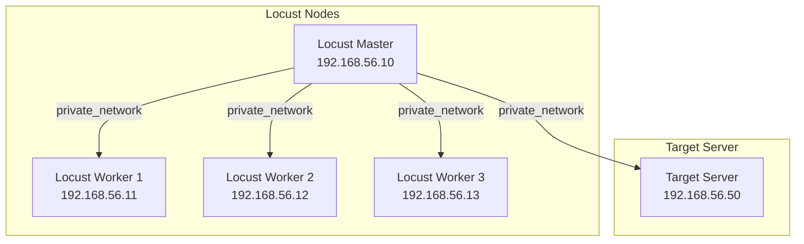

# Locust cluster met vagrant

## Inleiding

Deze repository bevat een Vagrantfile en een aantal scripts om een cluster van [locust] nodes op te zetten. 
Het was bedoeld om te leren hoe een gedistribueerde load test opgezet kan worden met [locust].

### Vereisten


1. Installeer [Vagrant].
1. Installeer [VirtualBox].
1. Installeer [tmux]. (optioneel)

## Setup



Als alles is opgestart dan kun je de [locust] master bereiken op [192.168.56.10:8089](http://192.168.56.10:8089).   
De target server, een default [nginx] installatie is bereikbaar op [192.168.56.50:80](http://192.168.56.50)

## Gebruik

1. Start de VM's met `vagrant up`
1. Wacht tot de VM's zijn opgestart
1. Voer `./start-locust.sh` uit. [tmux] nodig!
1. Open de [locust web interface]

## Handmatig starten

1. Start de VM's met `vagrant up`
1. Wacht tot de VM's zijn opgestart
1. login op de master met `vagrant ssh locust-master`
    1. ga naar de vagrant directory (daarin staat `locustfile.py`) met `cd /vagrant`
    1. Start de locust master met  
       ```sh
       locust -f locustfile.py --master --master-bind-host=0.0.0.0 --host=http://192.168.56.50
       ```
1. login op de worker met `vagrant ssh locust-worker-1`
    1. ga naar de vagrant directory (daarin staat `locustfile.py`) met `cd /vagrant`
    1. Start de locust worker met  
       ```sh
       locust -f locustfile.py --worker --master-host=192.168.56.10 --processes=-1
       ```
    1. herhaal dit voor de andere workers
1. Open de [locust web interface]

## Meer / Minder workers

Je kunt het aantal workers aanpassen door zowel de `Vagrantfile` aan te passen als het `start-locust.sh` script.
Pas, in beide bestanden, het getal 3 aan naar het gewenste aantal workers.

Relevante regel in `Vagrantfile`:
```ruby
(1..3).each do |i|
```

Relevante regel in `start-locust.sh`:
```sh
for i in {1..3}; do
```

---

[locust]: https://locust.io/
[nginx]: https://www.nginx.org/
[locust web interface]: http://192.168.56.10:8089


[Vagrant]: https://www.vagrantup.com/
[VirtualBox]: https://www.virtualbox.org/
[tmux]: https://github.com/tmux/tmux
